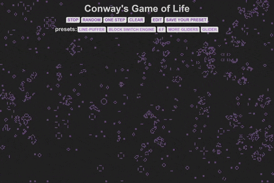

# Conway's Game of Life

---

## <a href="https://knyazev13ivan.github.io/game-the-life/">**Live Demo**</a>

---

Это классический паттерн **b2/s23**. 
Анимация реализованна с помощью **Canvas API** и **requestAnimationFrame**

---

### Управление
**START/STOP** - старт/пауза, запуск пресета. 
**RANDOM** - рандомное заполнение поля клетками. 
**ONE STEP** - в режиме __паузы__ игровой цикл делает один шаг. 
**CLEAR** - очищает поле. 
**EDIT** - игра переходит в режим редактирования. Можно **добавлять** и **удалять** клетки. В этом режиме можно сохранить свой пресет. 
**SAVE YOUR PRESET** - сохраняет в localStorage пресет. 

---

### Presets
Есть несколько пресетов для демонстрации. Их тожe можно отредактировать.
